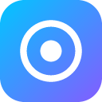
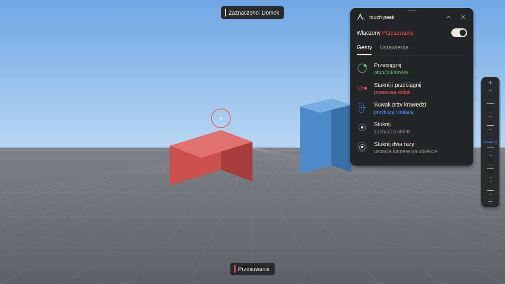
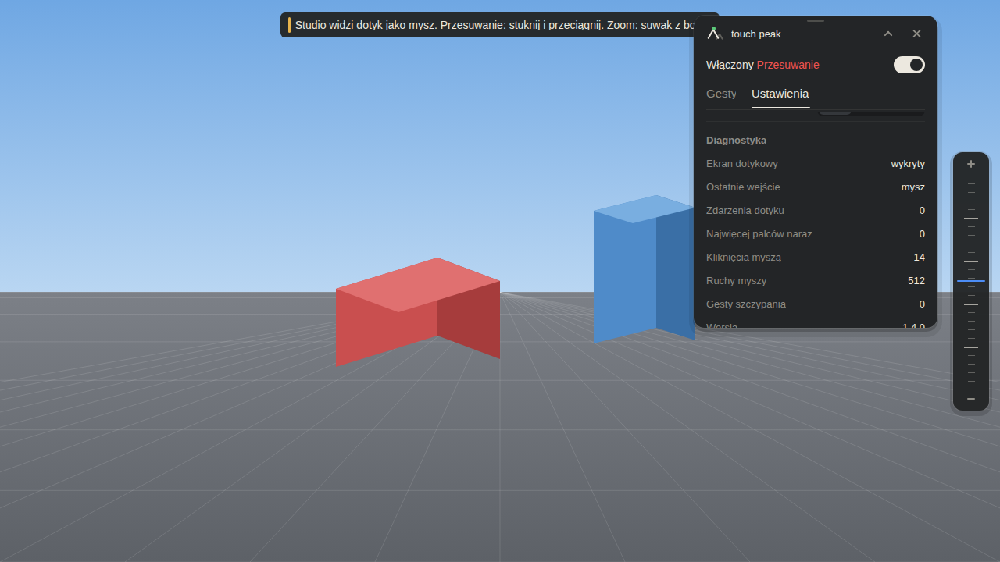
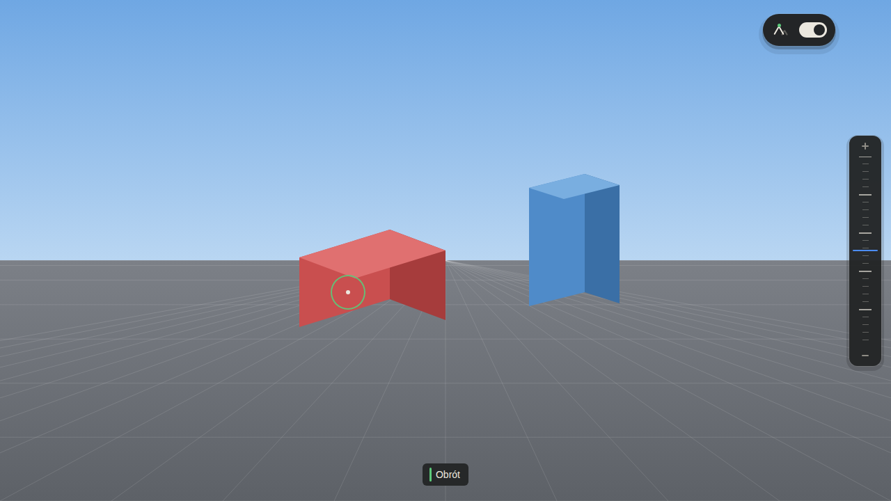

<p align="center">
  
</p>

<h1 align="center">Touch Peak</h1>

<p align="center">Plugin do Roblox Studio: obracaj, przesuwaj i przybliżaj kamerę palcem, a obiekty zaznaczaj stuknięciem.</p>



> Obrazki to rendery z narzędzia `tools/preview` (ten sam kod interfejsu, uruchomiony poza
> Studio). W Studio logotyp ma krój Michroma, a reszta tekstu Builder Sans.

## Sterowanie

| Co robisz | Co się dzieje |
| --- | --- |
| Przeciągnij jednym palcem | Kamera obraca się wokół punktu na środku ekranu (albo w miejscu) |
| Stuknij, potem od razu przeciągnij | Widok przesuwa się za palcem |
| Przesuń palcem po suwaku przy prawej krawędzi | W górę przybliża, w dół oddala |
| Stuknij | Zaznacza obiekt; stuknięcie w pustkę czyści zaznaczenie |
| Stuknij dwa razy | Kamera płynnie ustawia się na obiekcie |

Kolory w oknie odpowiadają uchwytom osi w Studio: obrót jest zielony, przesuwanie czerwone,
zoom niebieski. Pierścień pod palcem przybiera kolor ruchu, który właśnie wykonujesz.

**Dlaczego jednym palcem?** Roblox Studio na Windows zwykle przekazuje pluginom ekran
dotykowy jako mysz, więc drugi palec do pluginu nie dociera. Dlatego przesuwanie działa po
stuknięciu, a zoom ma własny suwak. Stuknięcie, które rozpoczyna przesuwanie, nie zmienia
zaznaczenia.

## Okno

Przycisk **Touch Peak** na karcie **Plugins** otwiera okno i włącza sterowanie.

- Lampka przy ikonie: zielona, gdy sterowanie jest włączone, bursztynowa, gdy wstrzymane.
- Przełącznik obok napisu „Włączony” wstrzymuje i wznawia sterowanie.
- Przeciągnij nagłówek, żeby przesunąć okno. Strzałka zwija je do małej pigułki z samą ikoną i
  przełącznikiem; pigułkę też można przeciągać, a stuknięcie w ikonę rozwija okno.
- Karta **Gesty** to ściąga, karta **Ustawienia** to opcje i diagnostyka.

| Ustawienia i diagnostyka | Zwinięte okno (pigułka) |
| --- | --- |
|  |  |

### Ustawienia

| Opcja | Opis |
| --- | --- |
| Czułość | Obrót, zoom i przesuwanie, od 0.25× do 3× |
| Obrót | **Orbita** wokół punktu, na który patrzysz, albo **W miejscu** (jak prawy przycisk myszy w Studio) |
| Bezwładność | Kamera wyhamowuje po szybkim machnięciu |
| Odwróć obrót, Odwróć przesuwanie | Zmieniają kierunek ruchu |
| Suwak zoomu | Pokazuje suwak i wybiera stronę ekranu (domyślnie prawa) |
| Zaznaczaj całe modele | Stuknięcie części zaznacza cały model, jak kliknięcie w Studio |
| Pokazuj dotyk | Pierścienie pod palcami |
| Mysz i rysik | Lewy przycisk działa jak palec; zostaw włączone, gdy Studio widzi dotyk jako mysz |
| Język | Auto (polski, gdy Studio lub system jest po polsku), PL albo EN |

Ustawienia zapisują się w Studio.

## Instalacja

W `dist/` są dwa pliki z tym samym pluginem:

| Plik | Do czego |
| --- | --- |
| [`TouchPeak.rbxlx`](dist/TouchPeak.rbxlx) | Miejsce (place) z pluginem rozłożonym w ServerStorage – do edycji i publikacji |
| [`TouchPeak.rbxmx`](dist/TouchPeak.rbxmx) | Sam plugin jako model – do folderu Plugins albo do wstawienia w dowolne miejsce |

Żeby tylko używać pluginu: wrzuć `TouchPeak.rbxmx` do folderu z **Plugins → Plugins Folder**
(Windows: `%LOCALAPPDATA%\Roblox\Plugins`, macOS: `~/Documents/Roblox/Plugins`) i uruchom
Studio ponownie.

## Edycja i publikacja w Creator Store

1. Otwórz `dist/TouchPeak.rbxlx` w Studio (**File → Open from File**). Plugin leży w
   **ServerStorage → TouchPeak**: główny skrypt oraz foldery `Camera`, `Input`, `Selection`,
   `UI` i `Util` z modułami. Skrypty w ServerStorage się nie uruchamiają, więc możesz je
   spokojnie edytować.

   Możesz też wstawić plugin do dowolnego innego miejsca: prawy przycisk na **ServerStorage →
   Insert from File...** i wybierz `TouchPeak.rbxmx`.
2. Jeśli wcześniej wrzuciłeś `TouchPeak.rbxmx` do folderu Plugins, usuń go stamtąd, żeby w
   Studio nie było dwóch przycisków Touch Peak.
3. Żeby przetestować zmiany: prawy przycisk na **TouchPeak → Save as Local Plugin...**.
4. Żeby opublikować: prawy przycisk na **TouchPeak → Publish as Plugin...**, wpisz nazwę i opis,
   opublikuj. Potem w Creator Hub (create.roblox.com, **Creations → Plugins**) ustaw ikonę i
   włącz udostępnianie w Creator Store. Kolejną wersję publikujesz tak samo, wybierając w tym
   oknie istniejący plugin, żeby go zaktualizować zamiast tworzyć nowy.
5. Własna ikona: wgraj obrazek przez **View → Asset Manager → Bulk Import**, kliknij go prawym
   przyciskiem → **Copy ID** i wklej jako `Icon = "rbxassetid://<id>"` w module **Config**. Pojawi
   się obok „touch peak”, w zwiniętej pigułce i na przycisku na pasku. Bez niej okno rysuje
   własny znak szczytu. Możesz użyć [`assets/icon.png`](assets/icon.png).

Zmiany zrobione w Studio nie trafiają same do repozytorium. Jeśli wolisz pisać kod w plikach z
`src/` i mieć go w Studio na żywo, użyj [Rojo](https://rojo.space): `rojo serve place.project.json`
i wtyczka Rojo w Studio zsynchronizują `src/` z **ServerStorage → TouchPeak**. Gotowe pliki do
`dist/` buduje `python tools/build_plugin.py` (albo `rojo build place.project.json -o TouchPeak.rbxlx`).

## Gdy coś nie działa

| Objaw | Co zrobić |
| --- | --- |
| Kamera w ogóle nie reaguje | Sprawdź, czy lampka jest zielona i czy **Mysz i rysik** jest włączone; w Diagnostyce powinny rosnąć liczniki |
| Lampka zrobiła się bursztynowa | Wybrano inne narzędzie Studio; włącz sterowanie przełącznikiem w oknie |
| Okno albo suwak zasłania widok | Zwiń okno do pigułki, przeciągnij je albo przenieś suwak na drugą stronę w Ustawieniach |

Podczas pracy plugin przejmuje mysz w widoku 3D, tak jak każde narzędzie Studio, żeby
narzędzia Select i Move nie przesuwały przy okazji części pod palcem. Działa tylko w trybie
edycji, nie w Play.

## Dla deweloperów

```
src/
  init.server.luau          przycisk na pasku i cykl życia pluginu
  App.luau                  łączy wejście, gesty, kamerę, zaznaczanie i interfejs
  Input/                    dotyk i mysz → gesty
  Camera/                   orbita, przesuwanie, zoom, bezwładność, ustawianie na obiekcie
  Selection/                zaznaczanie stuknięciem
  UI/                       okno, suwak zoomu, nakładka na widok, kontrolki
tests/                      testy w Lune na atrapie API Roblox
tools/                      budowanie .rbxmx, ikona, podgląd interfejsu
```

```bash
lune run tests/run                   # testy
stylua src tests                     # formatowanie
selene generate-roblox-std && selene src
python3 tools/build_plugin.py        # odśwież oba pliki w dist/ po zmianach w src
lune run tools/preview/export && node tools/preview/screenshot.js
```

Wersje narzędzi są w `rokit.toml`. Testy uruchamiają moduły pluginu w udawanym Studio, które
sprawdza nazwy i typy właściwości w bazie refleksji Roblox. Zachowanie dotyku zależy jednak od
urządzenia, więc czułość najlepiej dostroić na własnym ekranie.
